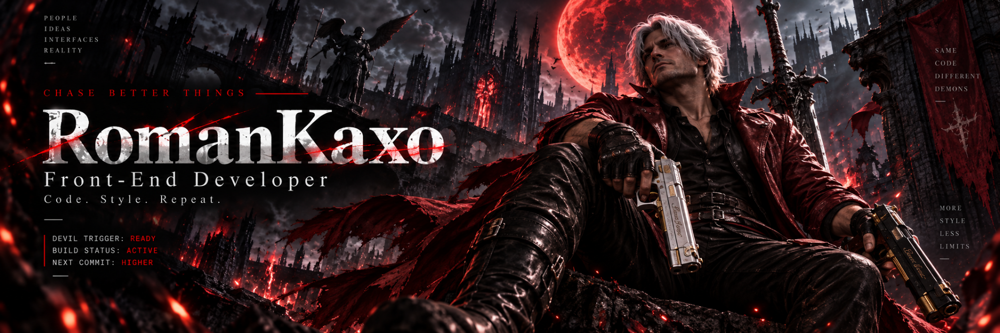
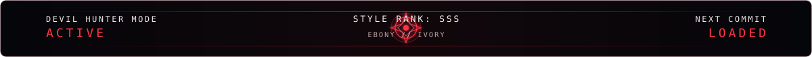

 

## `// MISSION BRIEFING`

I'm **Roman**, a Front-End Web Developer focused on building clean, maintainable web experiences for employers and independent clients.

I enjoy turning ideas into working websites, learning new technologies, and gradually expanding from front-end development toward a broader full-stack skill set.

I'm also interested in **AI-assisted development** and use modern AI tools as part of my everyday workflow.

Currently studying IT at **SOŠ EDUCAnet Brno**, with a focus on web development.

## `// CURRENT MISSION`

- Building and maintaining production interfaces at **StanekTech.cz** using HTML5, CSS3 and JavaScript
- Managing the website and social media for **Tři Mistři**
- Building custom websites for clients
- Learning backend development with **PHP, Laravel and MySQL**
- Learning **C#** to move further toward full-stack development
- Managing and customizing **WordPress** websites

## `// ACTIVE CONTRACTS`

## `// ARSENAL`

### Main loadout
`HTML5` · `CSS3` · `JavaScript` · `WordPress`

### Expanding the arsenal
`PHP` · `Laravel` · `MySQL` · `C#` · `Tailwind CSS`

## `// AI LOADOUT`

## `// LANGUAGE SETTINGS`

- 🇨🇿 **Czech** — Native
- 🇬🇧 **English** — B2

## `// COMMS`

 

 

Code. Style. Repeat.

