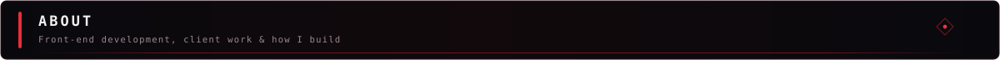
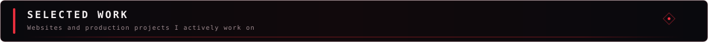
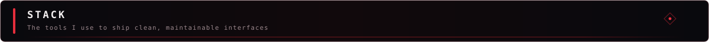
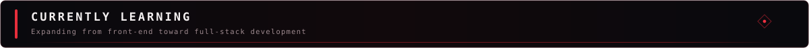
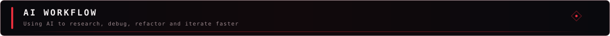
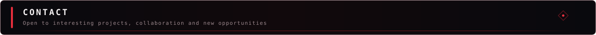

 

Front-End Developer building clean, maintainable web experiences.

I work on production interfaces, client websites and WordPress projects while gradually expanding toward full-stack development.

HTML · CSS · JavaScript · WordPress · PHP · Laravel · MySQL

 

I'm Roman, a front-end developer and IT student at SOŠ EDUCAnet Brno.

My main focus is turning designs and ideas into websites that are clean, responsive and easy to maintain. I currently work with production interfaces, manage web projects for clients, and keep learning technologies that move me beyond the front end.

What matters to me most is simple: build things properly, keep learning, and make each project better than the last one.

 

Tři Mistři — website management, ongoing updates and social media

Washwrap — custom client web project

Brandriders.sk — client website

OKRiders.sk — client website

 

Core
HTML5 · CSS3 · JavaScript · WordPress · Git

Also working with
PHP · Laravel · MySQL · Vite · Tailwind CSS

 

Right now I'm pushing further into backend and full-stack development — mainly PHP/Laravel, databases and C#.

I want to be comfortable owning more of a project end-to-end instead of stopping at the interface layer.

 

AI is part of my day-to-day development workflow for research, debugging, refactoring and faster iteration. I use it as a development tool, not a replacement for understanding the code I ship.

 

Czech — Native   ·   English — B2

 

  

