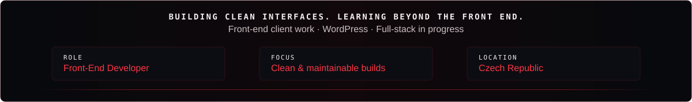
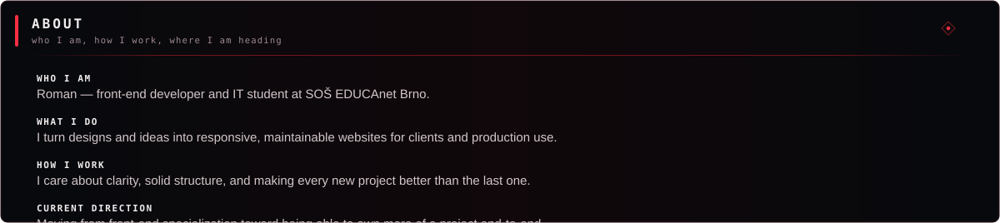
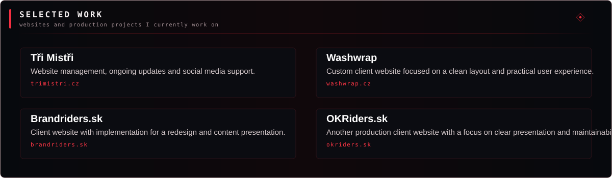
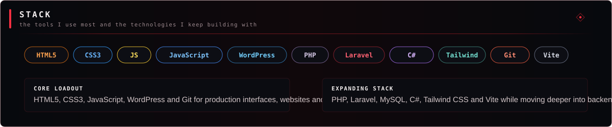
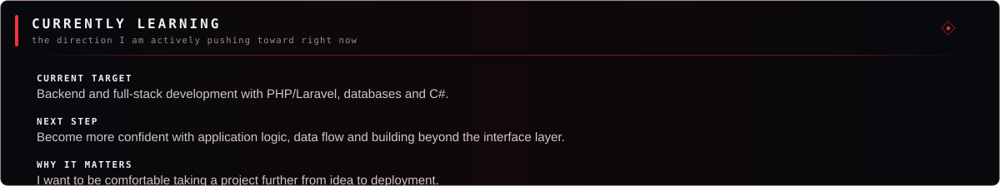
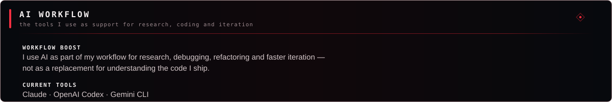
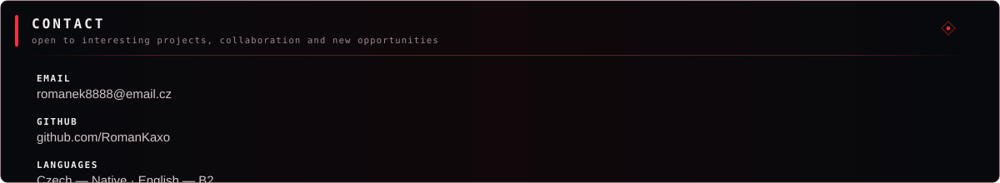

  
  
  
  
  
  
  
  
  
  

  
    <a href="https://trimistri.cz">trimistri.cz</a> •
    <a href="https://washwrap.cz">washwrap.cz</a> •
    <a href="https://brandriders.sk">brandriders.sk</a> •
    <a href="https://okriders.sk">okriders.sk</a> •
    <a href="mailto:romanek8888@email.cz">Email</a> •
    <a href="https://github.com/RomanKaxo">GitHub</a>
  

